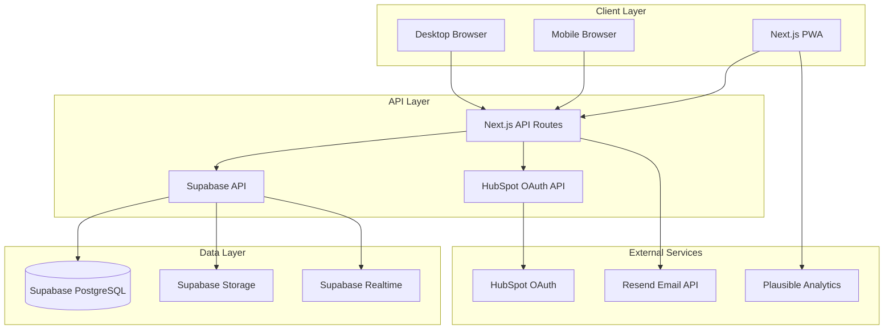

# Design Document

## Overview

The Global HubSpot Admin Competition Platform is designed as a modern Progressive Web App (PWA) using Next.js with a serverless architecture. The platform leverages Supabase for backend services, HubSpot OAuth for authentication, and implements a multi-tier competition system with real-time voting capabilities.

The architecture prioritizes scalability, security, and user experience while maintaining cost-effectiveness through open-source technologies and free-tier services.

## Architecture

### High-Level Architecture



### Technology Stack

**Frontend:**
- Next.js 14+ with App Router for SSR/SSG capabilities
- TypeScript for type safety
- Tailwind CSS for styling
- ShadCN/UI for component library
- PWA configuration with service workers

**Backend:**
- Supabase for database, authentication, and real-time features
- Next.js API routes for custom business logic
- Supabase Edge Functions for serverless compute

**Authentication:**
- HubSpot OAuth 2.0 integration
- Supabase Auth for session management
- JWT tokens for secure communication

**Storage & Media:**
- Supabase Storage for user-generated content
- Next.js Image optimization for performance
- CDN delivery for global performance

## Components and Interfaces

### Core Components

#### 1. Authentication System

**HubSpotAuthProvider**
```typescript
interface HubSpotAuthProvider {
  initiateOAuth(): Promise<string>
  handleCallback(code: string): Promise<User>
  verifyHubSpotAccount(accessToken: string): Promise<HubSpotProfile>
  refreshToken(refreshToken: string): Promise<AuthTokens>
}
```

**User Management**
```typescript
interface User {
  id: string
  hubspotId: string
  email: string
  profile: UserProfile
  role: UserRole
  verificationStatus: VerificationStatus
  createdAt: Date
  updatedAt: Date
}

interface UserProfile {
  displayName: string
  bio: string
  skills: string[]
  hubspotExperience: string
  portfolioLinks: string[]
  profilePicture?: string
  bannerImage?: string
  introVideo?: string
}
```

#### 2. Competition Management System

**Competition Entity**
```typescript
interface Competition {
  id: string
  title: string
  description: string
  tier: CompetitionTier
  country?: string
  status: CompetitionStatus
  registrationStart: Date
  registrationEnd: Date
  votingStart: Date
  votingEnd: Date
  maxParticipants?: number
  qualificationRules: QualificationRules
  createdBy: string
  createdAt: Date
}

enum CompetitionTier {
  LOCAL = 'local',
  NATIONAL = 'national',
  GLOBAL = 'global'
}
```

**Participation Management**
```typescript
interface Participation {
  id: string
  competitionId: string
  userId: string
  status: ParticipationStatus
  submissionData: SubmissionData
  voteCount: number
  ranking?: number
  appliedAt: Date
  approvedAt?: Date
}

interface SubmissionData {
  title: string
  description: string
  mediaFiles: MediaFile[]
  portfolioLinks: string[]
}
```

#### 3. Voting System

**Vote Management**
```typescript
interface Vote {
  id: string
  competitionId: string
  participantId: string
  voterId: string
  voterIP: string
  timestamp: Date
  verified: boolean
}

interface VotingService {
  castVote(vote: VoteRequest): Promise<VoteResult>
  validateVoter(userId: string): Promise<VoterValidation>
  checkDuplicateVote(competitionId: string, participantId: string, voterId: string): Promise<boolean>
  getVoteCount(participantId: string, competitionId: string): Promise<number>
}
```

#### 4. Real-time Leaderboard

**Leaderboard Service**
```typescript
interface LeaderboardService {
  getLeaderboard(competitionId: string, filters?: LeaderboardFilters): Promise<LeaderboardEntry[]>
  subscribeToUpdates(competitionId: string, callback: (update: LeaderboardUpdate) => void): Subscription
  calculateRankings(competitionId: string): Promise<void>
}

interface LeaderboardEntry {
  participantId: string
  participant: UserProfile
  voteCount: number
  ranking: number
  trend: RankingTrend
}
```

### API Interfaces

#### Authentication Endpoints
- `POST /api/auth/hubspot/initiate` - Start HubSpot OAuth flow
- `POST /api/auth/hubspot/callback` - Handle OAuth callback
- `POST /api/auth/refresh` - Refresh authentication tokens
- `POST /api/auth/logout` - Logout user

#### Competition Management
- `GET /api/competitions` - List competitions with filters
- `POST /api/competitions` - Create new competition (organizers only)
- `GET /api/competitions/:id` - Get competition details
- `PUT /api/competitions/:id` - Update competition (organizers only)
- `POST /api/competitions/:id/participants` - Apply for competition
- `PUT /api/competitions/:id/participants/:userId` - Approve/reject participant

#### Voting System
- `POST /api/competitions/:id/votes` - Cast vote
- `GET /api/competitions/:id/leaderboard` - Get current leaderboard
- `GET /api/competitions/:id/votes/status` - Check user's voting status

#### User Management
- `GET /api/users/profile` - Get current user profile
- `PUT /api/users/profile` - Update user profile
- `POST /api/users/media/upload` - Upload profile media

## Data Models

### Database Schema

**Users Table**
```sql
CREATE TABLE users (
  id UUID PRIMARY KEY DEFAULT gen_random_uuid(),
  hubspot_id VARCHAR UNIQUE NOT NULL,
  email VARCHAR UNIQUE NOT NULL,
  display_name VARCHAR NOT NULL,
  bio TEXT,
  skills JSONB DEFAULT '[]',
  hubspot_experience TEXT,
  portfolio_links JSONB DEFAULT '[]',
  profile_picture_url VARCHAR,
  banner_image_url VARCHAR,
  intro_video_url VARCHAR,
  role user_role DEFAULT 'participant',
  verification_status verification_status DEFAULT 'pending',
  created_at TIMESTAMP WITH TIME ZONE DEFAULT NOW(),
  updated_at TIMESTAMP WITH TIME ZONE DEFAULT NOW()
);
```

**Competitions Table**
```sql
CREATE TABLE competitions (
  id UUID PRIMARY KEY DEFAULT gen_random_uuid(),
  title VARCHAR NOT NULL,
  description TEXT,
  tier competition_tier NOT NULL,
  country VARCHAR,
  status competition_status DEFAULT 'draft',
  registration_start TIMESTAMP WITH TIME ZONE,
  registration_end TIMESTAMP WITH TIME ZONE,
  voting_start TIMESTAMP WITH TIME ZONE,
  voting_end TIMESTAMP WITH TIME ZONE,
  max_participants INTEGER,
  qualification_rules JSONB,
  created_by UUID REFERENCES users(id),
  created_at TIMESTAMP WITH TIME ZONE DEFAULT NOW(),
  updated_at TIMESTAMP WITH TIME ZONE DEFAULT NOW()
);
```

**Participations Table**
```sql
CREATE TABLE participations (
  id UUID PRIMARY KEY DEFAULT gen_random_uuid(),
  competition_id UUID REFERENCES competitions(id),
  user_id UUID REFERENCES users(id),
  status participation_status DEFAULT 'pending',
  submission_title VARCHAR,
  submission_description TEXT,
  submission_media JSONB DEFAULT '[]',
  vote_count INTEGER DEFAULT 0,
  ranking INTEGER,
  applied_at TIMESTAMP WITH TIME ZONE DEFAULT NOW(),
  approved_at TIMESTAMP WITH TIME ZONE,
  UNIQUE(competition_id, user_id)
);
```

**Votes Table**
```sql
CREATE TABLE votes (
  id UUID PRIMARY KEY DEFAULT gen_random_uuid(),
  competition_id UUID REFERENCES competitions(id),
  participant_id UUID REFERENCES participations(id),
  voter_id UUID REFERENCES users(id),
  voter_ip INET,
  timestamp TIMESTAMP WITH TIME ZONE DEFAULT NOW(),
  verified BOOLEAN DEFAULT false,
  UNIQUE(competition_id, participant_id, voter_id)
);
```

### Real-time Subscriptions

**Leaderboard Updates**
```typescript
// Subscribe to real-time leaderboard changes
const subscription = supabase
  .channel('leaderboard')
  .on('postgres_changes', {
    event: 'UPDATE',
    schema: 'public',
    table: 'participations',
    filter: `competition_id=eq.${competitionId}`
  }, (payload) => {
    updateLeaderboard(payload.new)
  })
  .subscribe()
```

## Error Handling

### Error Types and Responses

**Authentication Errors**
- `AUTH_INVALID_TOKEN` - Invalid or expired JWT token
- `AUTH_HUBSPOT_FAILED` - HubSpot OAuth verification failed
- `AUTH_INSUFFICIENT_PERMISSIONS` - User lacks required permissions

**Voting Errors**
- `VOTE_DUPLICATE` - User already voted for this participant
- `VOTE_COMPETITION_CLOSED` - Voting period has ended
- `VOTE_RATE_LIMITED` - Too many voting attempts
- `VOTE_INVALID_PARTICIPANT` - Participant not found or not approved

**Competition Errors**
- `COMPETITION_FULL` - Maximum participants reached
- `COMPETITION_REGISTRATION_CLOSED` - Registration period ended
- `COMPETITION_INVALID_TIER` - Invalid competition tier progression

### Error Response Format
```typescript
interface ErrorResponse {
  error: {
    code: string
    message: string
    details?: any
    timestamp: string
  }
}
```

### Global Error Handling
- Client-side error boundary components
- Centralized error logging with Supabase
- User-friendly error messages with recovery suggestions
- Automatic retry mechanisms for transient failures

## Testing Strategy

### Unit Testing
- **Framework:** Jest with React Testing Library
- **Coverage:** All utility functions, hooks, and components
- **Mocking:** Supabase client, HubSpot API, external services

### Integration Testing
- **API Routes:** Test all Next.js API endpoints
- **Database Operations:** Test CRUD operations with test database
- **Authentication Flow:** End-to-end OAuth testing

### End-to-End Testing
- **Framework:** Playwright for cross-browser testing
- **Scenarios:** 
  - Complete user registration and profile creation
  - Competition participation workflow
  - Voting process with fraud prevention
  - Real-time leaderboard updates
  - Multi-tier competition progression

### Performance Testing
- **Load Testing:** Simulate concurrent voting scenarios
- **PWA Testing:** Offline functionality and service worker behavior
- **Mobile Testing:** Performance on various mobile devices
- **Accessibility Testing:** WCAG 2.1 compliance verification

### Security Testing
- **Authentication:** OAuth flow security testing
- **Authorization:** Role-based access control verification
- **Input Validation:** SQL injection and XSS prevention
- **Rate Limiting:** Anti-fraud mechanism testing

### Testing Environment Setup
```typescript
// Test configuration
const testConfig = {
  supabase: {
    url: process.env.SUPABASE_TEST_URL,
    anonKey: process.env.SUPABASE_TEST_ANON_KEY
  },
  hubspot: {
    clientId: process.env.HUBSPOT_TEST_CLIENT_ID,
    clientSecret: process.env.HUBSPOT_TEST_CLIENT_SECRET
  }
}
```

### Continuous Integration
- **GitHub Actions:** Automated testing on pull requests
- **Test Coverage:** Minimum 80% code coverage requirement
- **Security Scanning:** Automated vulnerability detection
- **Performance Monitoring:** Lighthouse CI for performance regression detection